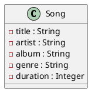

<scenario>
# The task relates to the following initial situation:

A music streaming service maintains a vast library of songs. Each song has metadata associated with it, such as the song title, artist, album, genre, and duration.  The service allows users to create and manage playlists.  A playlist is simply an ordered list of songs.
</scenario>

<problem>
## 1. Task (25 points)

The music streaming service wants to implement a feature that allows users to shuffle their playlists.  The shuffle feature should randomize the order of songs in a playlist while ensuring that no song appears more than once.
</problem>

<data_elements>
The following class definitions are relevant:

Public access methods (get/set) are available for each attribute.

The `List<Song>` class supports the following methods:

* `get(index: Integer): Song`: Returns the song at the specified index.
* `set(index: Integer, song: Song): void`: Sets the song at the specified index.
* `size(): Integer`: Returns the number of songs in the list.
* `add(song: Song): void`: Adds a song to the end of the list.
* `remove(index: Integer): Song`: Removes and returns the song at the specified index.

A helper function `getRandomInt(min: Integer, max: Integer): Integer` is available, which returns a pseudo-random integer between min (inclusive) and max (exclusive).  Assume this function is already implemented and works correctly.
</data_elements>

<pseudocode_task>
Create a function `shufflePlaylist(playlist: Playlist): void` that shuffles the songs within the provided playlist. The function should modify the playlist in-place, randomizing the order of songs. Ensure that every song from the original playlist is present in the shuffled playlist exactly once.

Specify the algorithm in pseudocode.

`shufflePlaylist(playlist: Playlist): void`
</pseudocode_task>